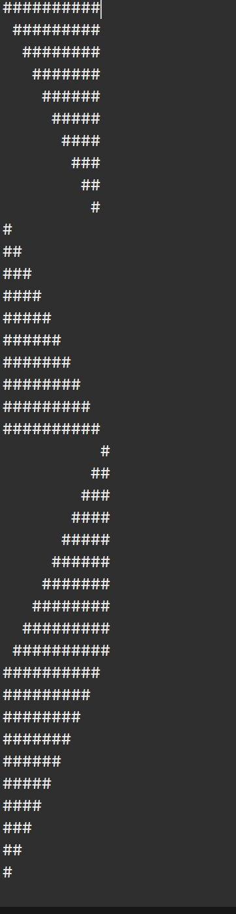
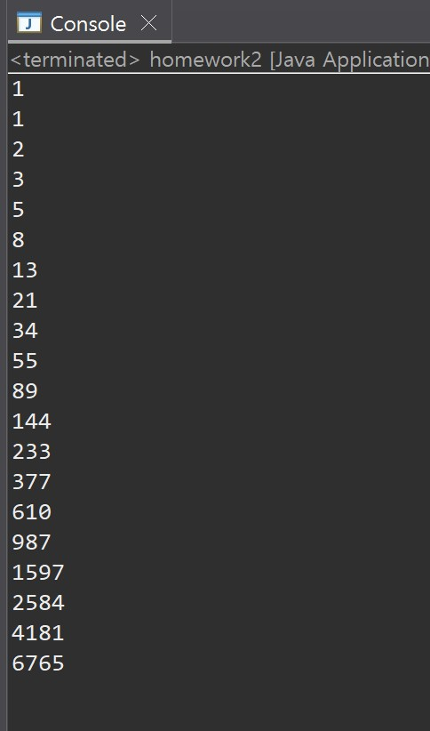

# OOP2026
### Homework1
```java
// homework1
public class Homework1 {
	public static void main(String[] args) {
	    int i, j;
	    for(i=0; i<10; i++) {
	      for(j=0; j<i; j++) {
	    	  System.out.print(" ");
	      }
	      for(j=0; j<10-i; j++) {
	    	  System.out.print("#");
	      }
	      System.out.println();
	    }
	    
		for(i=0; i<10; i++) {
			for(j=0; j<=i; j++) {
				System.out.print("#");
			}
			System.out.println();
		}
		
		for(i=0; i<10; i++) {
			for(j=0; j<=9-i; j++) {
				System.out.print(" ");
			}
			for(j=0; j<=i; j++) {
				System.out.print("#");
			}
			System.out.println();
		}
	    
		for(i=0; i<10; i++) {
			for(j=0; j<10-i; j++) {
				System.out.print("#");
			}
			System.out.println();
		}
	}
}


// homework2
public class homework2 {
	public static void main(String []args) {
		int i = 1;
		int j = 1;
		int k;
		System.out.println(i);
		System.out.println(j);
		for(k=0; k<9; k++) {
			i = i + j;
			j = j + i;
			System.out.println(i);
			System.out.println(j);
		}
	}
}

