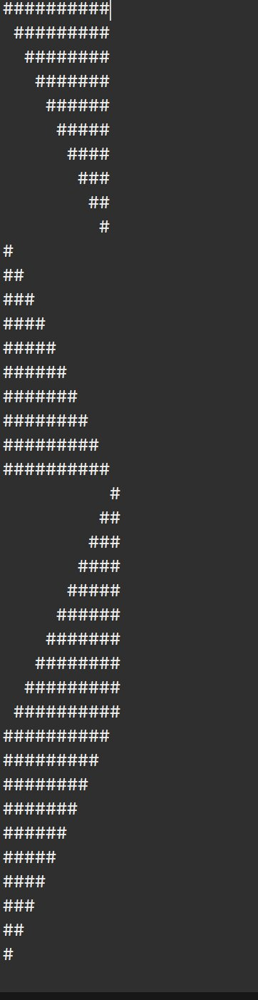
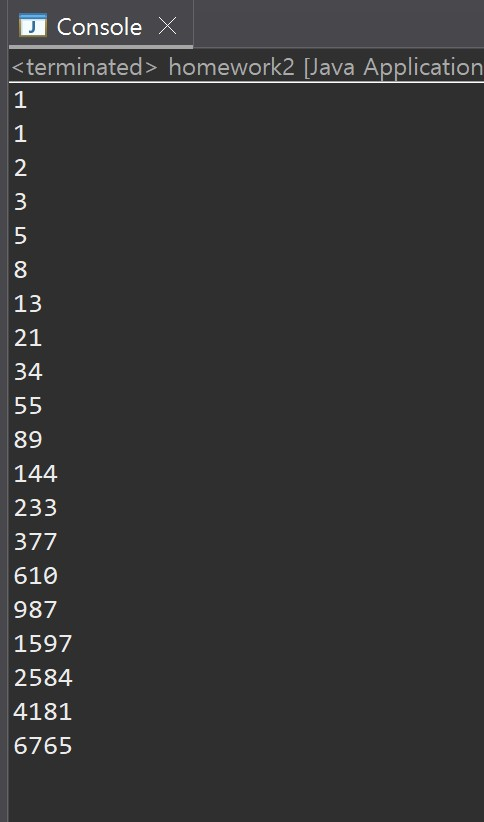
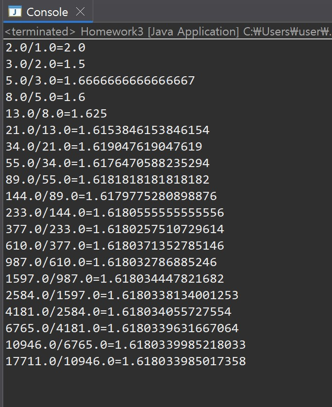
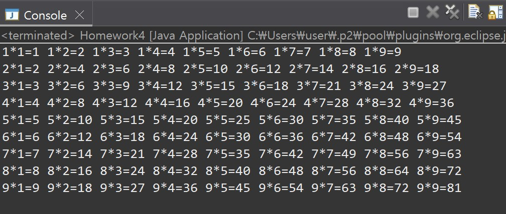
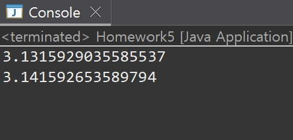
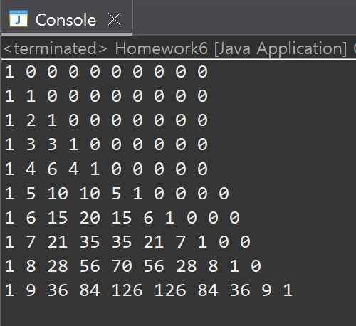

# OOP2026
### Homework1
```java
// homework1
public class Homework1 {
	public static void main(String[] args) {
	    int i, j;
	    for(i=0; i<10; i++) {
	      for(j=0; j<i; j++) {
	    	  System.out.print(" ");
	      }
	      for(j=0; j<10-i; j++) {
	    	  System.out.print("#");
	      }
	      System.out.println();
	    }
	    
		for(i=0; i<10; i++) {
			for(j=0; j<=i; j++) {
				System.out.print("#");
			}
			System.out.println();
		}
		
		for(i=0; i<10; i++) {
			for(j=0; j<=9-i; j++) {
				System.out.print(" ");
			}
			for(j=0; j<=i; j++) {
				System.out.print("#");
			}
			System.out.println();
		}
	    
		for(i=0; i<10; i++) {
			for(j=0; j<10-i; j++) {
				System.out.print("#");
			}
			System.out.println();
		}
	}
}
```


## Homework2
``` java
public class homework2 {
	public static void main(String []args) {
		int i = 1;
		int j = 1;
		int k;
		System.out.println(i);
		System.out.println(j);
		for(k=0; k<9; k++) {
			i = i + j;
			j = j + i;
			System.out.println(i);
			System.out.println(j);
		}
	}
}
```


## Homework3
``` java
public class Homework3 {
	public static void main(String []args) {
		double i = 2;
		double j = 1;
		int k;
		System.out.println(i+"/"+j+"="+i/j);
		for (k=0; k<19; k++) {
			i = i + j;
			j = i - j;
			System.out.println(i+"/"+j+"="+i/j);
		}
	}
}
```


## Homework4
``` java
public class Homework4 {
	public static void main(String []args) {
		int i = 1;
		int j = 1;
		int k;
		for (i=1; i<=9; i++) {
			for(k=0; k<9; k++) {
				System.out.print(i+"*"+j+"="+i*j + " ");
				j++;
				if (j>9)
					j=1;
		}
			System.out.println();
	}
}
}
```


## Homework5
```java
public class Homework5 {
	public static void main (String[] args) {
		int i, sign=1;
		double sum = 0;
		for(i=0; i<100; i++) {
			sum += sign*4.0/(2.0*i+1.0);
			sign *= -1;
		}
		System.out.println(sum);
		
		sum=0; //sum 다시 0으로 초기화해주기
		
		for(i=0; i<100; i++) {
			sum += sign*1.0/((2.0*i+1.0)*Math.pow(3.0, i));
			sign *= -1;
		}
		System.out.println(sum*Math.sqrt(12));
	}
}
```


## Homework6
```java
public class Homework6 {
	public static void main (String[] args) {
		int i, j, n = 10;
		int array[] = new int[n];
		int binomial[][] = new int[n][n];
		float farr[] = new float[n];
		double darr[] = new double[n];
		for (i=0; i<n; i++) {
			binomial[i][0] = binomial[i][i] = 1;
			
			for(j=1; j<i; j++) {
				binomial[i][j] = binomial[i-1][j-1] + binomial[i-1][j];
			}
		}
		
		printArray(n, binomial);
	}
	
static void printArray(int n, int binomial[][]) {
		int i, j;
		for(i=0; i<n; i++) {
			for(j=0; j<n; j++) {
				System.out.print(binomial[i][j]+" ");
			}
			System.out.println();
		}
	}
}
```

